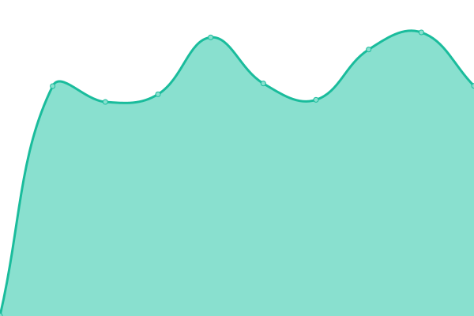

# [📈 Live Status](https://status.samstack.site): <!--live status--> **🟩 All systems operational**

This repository contains the open-source uptime monitor and status page for [Ibtisam Ahmed](https://status.samstack.site), powered by [Upptime](https://github.com/upptime/upptime).

With [Upptime](https://upptime.js.org), you can get your own unlimited and free uptime monitor and status page, powered entirely by a GitHub repository. We use [Issues](https://github.com/Sam-Builds/UptimeRepo/issues) as incident reports, [Actions](https://github.com/Sam-Builds/UptimeRepo/actions) as uptime monitors, and [Pages](https://status.samstack.site) for the status page.

<!--start: status pages-->
<!-- This summary is generated by Upptime (https://github.com/upptime/upptime) -->
<!-- Do not edit this manually, your changes will be overwritten -->
<!-- prettier-ignore -->
| URL | Status | History | Response Time | Uptime |
| --- | ------ | ------- | ------------- | ------ |
|  [Main Portfolio](https://www.samstack.site) | 🟩 Up | [main-portfolio.yml](https://github.com/Sam-Builds/UptimeRepo/commits/HEAD/history/main-portfolio.yml) | 

 892ms
     
 | 

<a href="https://status.samstack.site/history/main-portfolio">100.00%</a>
    

|  [Project Adithya (Blood Donation)](https://projectadithya.samstack.site) | 🟩 Up | [project-adithya-blood-donation.yml](https://github.com/Sam-Builds/UptimeRepo/commits/HEAD/history/project-adithya-blood-donation.yml) | 

 162ms
     
 | 

<a href="https://status.samstack.site/history/project-adithya-blood-donation">100.00%</a>
    

|  [Bin's Middleman Site (Unfinished)](https://deals.samstack.site) | 🟩 Up | [bin-s-middleman-site-unfinished.yml](https://github.com/Sam-Builds/UptimeRepo/commits/HEAD/history/bin-s-middleman-site-unfinished.yml) | 

 892ms
     
 | 

<a href="https://status.samstack.site/history/bin-s-middleman-site-unfinished">100.00%</a>
    

|  [IDT Data Entry](https://dataentry.samstack.site) | 🟩 Up | [idt-data-entry.yml](https://github.com/Sam-Builds/UptimeRepo/commits/HEAD/history/idt-data-entry.yml) | 

 863ms
     
 | 

<a href="https://status.samstack.site/history/idt-data-entry">100.00%</a>
    

|  [YenApp Purge Account](https://purgeaccount.samstack.site) | 🟩 Up | [yen-app-purge-account.yml](https://github.com/Sam-Builds/UptimeRepo/commits/HEAD/history/yen-app-purge-account.yml) | 

 900ms
     
 | 

<a href="https://status.samstack.site/history/yen-app-purge-account">100.00%</a>
    

|  [Server Center Console](https://debug.samstack.site) | 🟩 Up | [server-center-console.yml](https://github.com/Sam-Builds/UptimeRepo/commits/HEAD/history/server-center-console.yml) | 

 877ms
     
 | 

<a href="https://status.samstack.site/history/server-center-console">100.00%</a>
    

|  [Secret Santa](https://secretsanta.samstack.site) | 🟩 Up | [secret-santa.yml](https://github.com/Sam-Builds/UptimeRepo/commits/HEAD/history/secret-santa.yml) | 

 913ms
     
 | 

<a href="https://status.samstack.site/history/secret-santa">100.00%</a>
    

|  [Privacy Policy](https://www.samstack.site/privacy) | 🟩 Up | [privacy-policy.yml](https://github.com/Sam-Builds/UptimeRepo/commits/HEAD/history/privacy-policy.yml) | 

 803ms
     
 | 

<a href="https://status.samstack.site/history/privacy-policy">100.00%</a>
    

|  [MAIN API (Test Endpoint)](https://api.samstack.site/api/test) | 🟩 Up | [main-api-test-endpoint.yml](https://github.com/Sam-Builds/UptimeRepo/commits/HEAD/history/main-api-test-endpoint.yml) | 

 871ms
     
 | 

<a href="https://status.samstack.site/history/main-api-test-endpoint">100.00%</a>
    

|  [IDT Blood Donation API (Health)](https://adithyasapi.samstack.site/api/health) | 🟩 Up | [idt-blood-donation-api-health.yml](https://github.com/Sam-Builds/UptimeRepo/commits/HEAD/history/idt-blood-donation-api-health.yml) | 

 865ms
     
 | 

<a href="https://status.samstack.site/history/idt-blood-donation-api-health">100.00%</a>
    

<!--end: status pages-->

[**Visit our status website →**](https://status.samstack.site)

## 📄 License

- Powered by: [Upptime](https://github.com/upptime/upptime)
- Code: [MIT](./LICENSE) © [Anand Chowdhary](https://anandchowdhary.com), supported by [Pabio](https://pabio.com)
- Data in the `./history` directory: [Open Database License](https://opendatacommons.org/licenses/odbl/1-0/)
