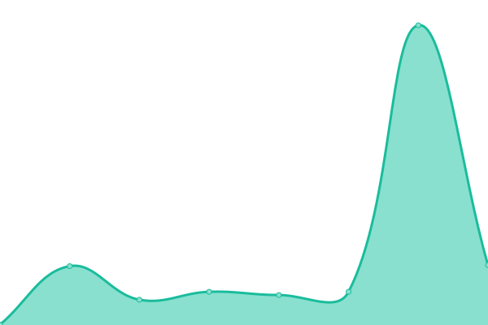
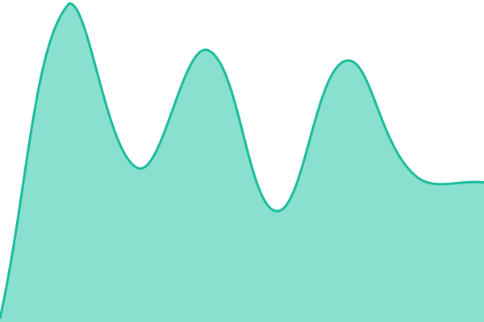
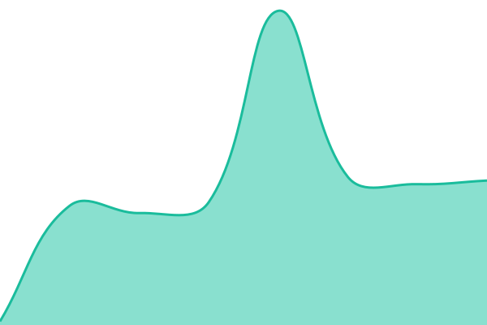
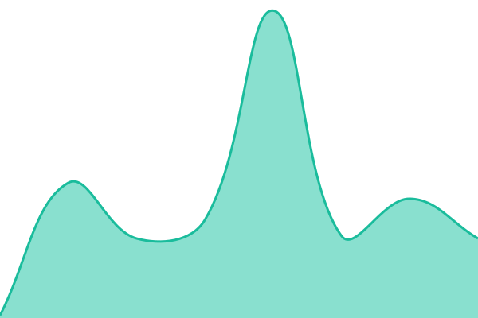
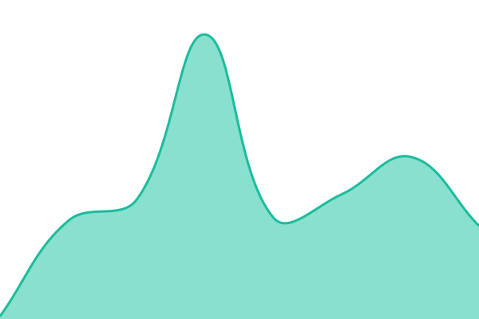
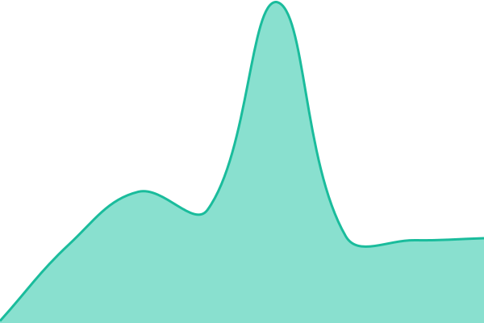

# [📈 Live Status](https://status.samstack.site): <!--live status--> **🟧 Partial outage**

This repository contains the open-source uptime monitor and status page for [Ibtisam Ahmed](https://www.samstack.site).

I use [Issues](https://github.com/Sam-Builds/UptimeRepo/issues) as incident reports, [Actions](https://github.com/Sam-Builds/UptimeRepo/actions) as uptime monitors, and [Pages](https://status.samstack.site) for the status page.

<!--start: status pages-->
<!-- This summary is generated by Upptime (https://github.com/upptime/upptime) -->
<!-- Do not edit this manually, your changes will be overwritten -->
<!-- prettier-ignore -->
| URL | Status | History | Response Time | Uptime |
| --- | ------ | ------- | ------------- | ------ |
|  [Main Portfolio](https://www.samstack.site) | 🟥 Down | [main-portfolio.yml](https://github.com/Sam-Builds/UptimeRepo/commits/HEAD/history/main-portfolio.yml) | 

 0ms
     
 | 

<a href="https://status.samstack.site/history/main-portfolio">0.00%</a>
    

|  [Project Adithya](https://projectadithya.samstack.site) | 🟩 Up | [project-adithya.yml](https://github.com/Sam-Builds/UptimeRepo/commits/HEAD/history/project-adithya.yml) | 

 167ms
     
 | 

<a href="https://status.samstack.site/history/project-adithya">100.00%</a>
    

|  [Data Entry Portal](https://dataentry.samstack.site) | 🟩 Up | [data-entry-portal.yml](https://github.com/Sam-Builds/UptimeRepo/commits/HEAD/history/data-entry-portal.yml) | 

 888ms
     
 | 

<a href="https://status.samstack.site/history/data-entry-portal">100.00%</a>
    

|  [Secret Santa](https://secretsanta.samstack.site) | 🟩 Up | [secret-santa.yml](https://github.com/Sam-Builds/UptimeRepo/commits/HEAD/history/secret-santa.yml) | 

 870ms
     
 | 

<a href="https://status.samstack.site/history/secret-santa">100.00%</a>
    

|  [Privacy Policy](https://www.samstack.site/privacy) | 🟥 Down | [privacy-policy.yml](https://github.com/Sam-Builds/UptimeRepo/commits/HEAD/history/privacy-policy.yml) | 

 0ms
     
 | 

<a href="https://status.samstack.site/history/privacy-policy">0.00%</a>
    

|  [Bin's Middleman (WIP)](https://deals.samstack.site) | 🟥 Down | [bin-s-middleman-wip.yml](https://github.com/Sam-Builds/UptimeRepo/commits/HEAD/history/bin-s-middleman-wip.yml) | 

 851ms
     
 | 

<a href="https://status.samstack.site/history/bin-s-middleman-wip">0.00%</a>
    

|  [YenApp Purge](https://purgeaccount.samstack.site) | 🟩 Up | [yen-app-purge.yml](https://github.com/Sam-Builds/UptimeRepo/commits/HEAD/history/yen-app-purge.yml) | 

 875ms
     
 | 

<a href="https://status.samstack.site/history/yen-app-purge">100.00%</a>
    

|  [Server Console](https://debug.samstack.site) | 🟩 Up | [server-console.yml](https://github.com/Sam-Builds/UptimeRepo/commits/HEAD/history/server-console.yml) | 

 866ms
     
 | 

<a href="https://status.samstack.site/history/server-console">100.00%</a>
    

|  [Main API Health](https://api.samstack.site/api/test) | 🟥 Down | [main-api-health.yml](https://github.com/Sam-Builds/UptimeRepo/commits/HEAD/history/main-api-health.yml) | 

 882ms
     
 | 

<a href="https://status.samstack.site/history/main-api-health">1.28%</a>
    

|  [Blood Donation API](https://adithyasapi.samstack.site/api/health) | 🟩 Up | [blood-donation-api.yml](https://github.com/Sam-Builds/UptimeRepo/commits/HEAD/history/blood-donation-api.yml) | 

 876ms
     
 | 

<a href="https://status.samstack.site/history/blood-donation-api">99.07%</a>
    

<!--end: status pages-->

[**Visit my status website →**](https://status.samstack.site)
